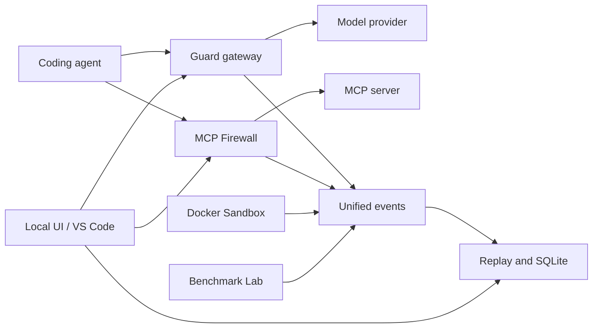
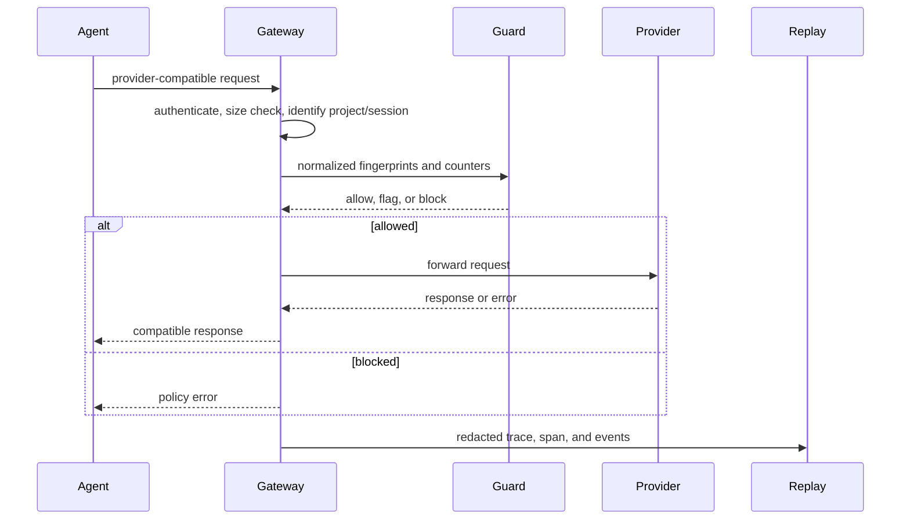

# Architecture

Agent Loop Guard is a local Python application with one CLI, one SQLite database, a FastAPI control surface, and optional adapters for external processes.



## Modules

| Package | Responsibility |
| --- | --- |
| `app/core` | Configuration, detector logic, authentication, redaction |
| `app/api` | Provider-compatible proxy, local admin API, Replay and MCP endpoints |
| `app/db` | SQLAlchemy models, repository operations, SQLite lifecycle |
| `app/platform` | Shared event contract, setup, diagnostics, backup and migration services |
| `app/mcp` | JSON-RPC transport proxies, policies, approvals, audit |
| `app/replay` | SDK, trace formats, cost calculation |
| `app/benchmark` | Dataset, adapters, scorers, observations, statistics |
| `app/sandbox` | Docker command construction, copied workspaces, diff/apply |
| `extensions/vscode` | Editor lifecycle and embedded local views |

Dependencies point toward `core` and `platform`. Optional modules should communicate through stable events and repositories instead of importing UI internals.

## Guard request lifecycle



Guard is effective only for traffic routed through the gateway. Session identity comes from explicit correlation headers or generated local IDs.

## MCP lifecycle

The MCP layer terminates either stdio JSON-RPC or Streamable HTTP, preserves request IDs, forwards initialization and notifications, filters `tools/list`, validates `tools/call` arguments against the discovered JSON Schema, and applies the local policy before upstream execution. Confirm decisions wait in a process-local approval queue and are visible in the local UI.

HTTP sessions preserve the MCP session header. Policy files hot reload. Task-based MCP execution remains outside the current implementation.

## Persistence

SQLite stores Guard sessions and events, projects and policies, agents, Replay runs/spans/events/artifacts, and MCP audit state. Alembic revisions evolve the schema. Benchmark observations and Sandbox exports are file artifacts by default.

The default deployment is one local process and one user. SQLite concurrency, in-memory rate limits, and in-process approval queues are deliberate pre-1.0 constraints.

## Privacy boundaries

Request bodies are parsed transiently to proxy them. Metadata logging and recursive redaction are default. Full content logging is an explicit configuration risk. Provider keys remain environment/config inputs and should never be emitted into events.

## Extension boundary

The VS Code extension owns only the process it launches. The Python runtime remains the source of truth for policy, storage, and APIs, so other editors and agents can integrate without depending on VS Code.

## Future integration

The intended end-to-end path is:

```text
Agent request -> Loop Guard -> MCP Firewall -> Sandbox -> Replay -> Benchmark report
```

The current modules are usable independently. A v1.0 dashboard and deeper cross-module orchestration remain future work; see [project status](status.md).
