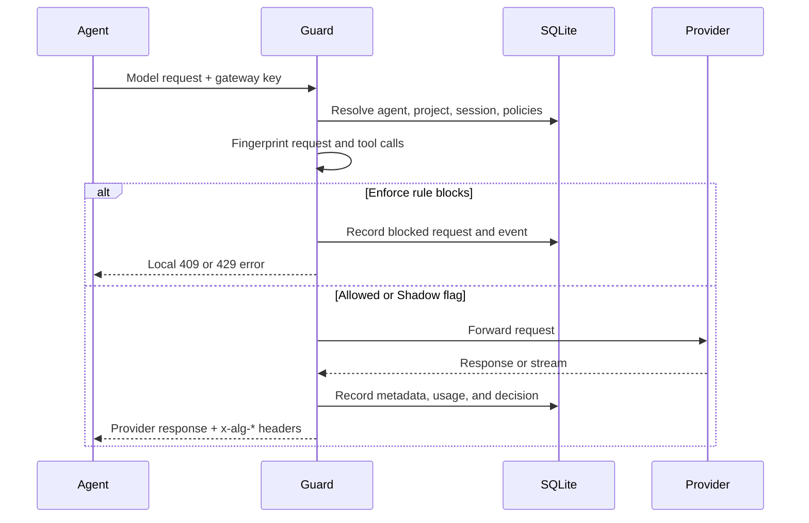

# Loop Guard

Loop Guard sits between a coding agent and an OpenAI-compatible or Anthropic-compatible model endpoint. It fingerprints recent activity, evaluates local policies, records the decision, and either forwards or blocks the request.

## Request flow



## Supported proxy endpoints

OpenAI-compatible:

```text
POST /v1/responses
POST /v1/chat/completions
GET  /v1/models
```

Anthropic-compatible:

```text
POST /v1/messages
POST /v1/messages/count_tokens
```

Both standard and streaming responses are supported. Streaming requests are recorded when the iterator closes, including partial or interrupted streams.

## Detection rules

| Rule type | Default threshold/window | Reason code | Behavior |
| --- | --- | --- | --- |
| `exact_repeat` | 3 in 8 | `LOOP_EXACT` | Same normalized request fingerprint repeats |
| `tool_repeat` | 3 in 8 | `LOOP_TOOL_CALL` | Same tool name and canonical argument hash repeats |
| `error_retry` | 5 consecutive | `LOOP_ERROR_RETRY` | Same upstream status/type/message fingerprint repeats |
| `sequence_repeat` | 3 repetitions in 15 | `LOOP_SEQUENCE` | A request sequence of length 2–5 repeats |
| `max_requests` | 50 per session | `LIMIT_REQUESTS` | Session reaches request limit |
| `max_tokens` | 100,000 per session | `LIMIT_TOKENS` | Session reaches recorded token limit |

Request fingerprints include `model`, `messages`, `input`, `system`, `tools`, and `tool_choice`. Volatile keys such as request IDs, timestamps, and trace IDs are ignored. Whitespace is normalized and object keys are canonicalized.

Tool-call detection recognizes OpenAI function objects, Anthropic `tool_use` objects, and generic `tool_name` payloads. Arguments are parsed when possible and hashed; raw arguments are not needed for loop matching.

## Shadow and Enforce modes

**Shadow** is the default. A matching policy produces `shadow_flag`, records an event, and still forwards the request.

**Enforce** produces a local block when the policy action is `block`:

- loop and budget rules return HTTP `429`;
- manually paused sessions or agent keys return HTTP `409`.

Set the project default in YAML:

```yaml
projects:
  default:
    mode: enforce
```

When `server.allow_mode_header` is enabled, a request can select a mode:

```http
x-alg-mode: shadow
```

Use the header for controlled tests, not as the only enforcement boundary for untrusted clients.

## Response metadata

Guard responses include:

| Header | Example | Meaning |
| --- | --- | --- |
| `x-alg-request-id` | `algreq_...` | Local request correlation ID |
| `x-alg-decision` | `allow`, `shadow_flag`, `block` | Final policy result |
| `x-alg-reason` | `LOOP_EXACT` | Present when a rule triggered |

A blocked response has this shape:

```json
{
  "error": {
    "type": "agent_loop_guard_block",
    "code": "LOOP_EXACT",
    "message": "The same normalized request repeated in the recent window.",
    "session_id": "ses_...",
    "rule_id": "rule_exact_repeat"
  }
}
```

## Edit Guard policies

Use the local **Policies** page or the administration API. A policy contains:

```json
{
  "id": "rule_exact_repeat",
  "rule_type": "exact_repeat",
  "threshold": 3,
  "window_size": 8,
  "action": "block",
  "enabled": true
}
```

Disable a rule with `enabled: false`. Unknown rule types can be stored but have no evaluator until implemented.

## Pause and resume

Pause a single session or agent key from the dashboard or API:

```bash
curl -X POST http://127.0.0.1:8787/api/sessions/SESSION_ID/pause
curl -X POST http://127.0.0.1:8787/api/agents/AGENT_ID/pause
```

Manual pauses block regardless of Shadow mode.

## Privacy behavior

By default, request and response previews are metadata-only. The database stores normalized fingerprints, token counters, provider status, latency, decisions, and detected tool hashes.

With `storage.full_content_logging: true`, redacted JSON previews of up to 500 characters are stored. Streaming previews collect at most the first 1000 bytes before redaction and truncation.
