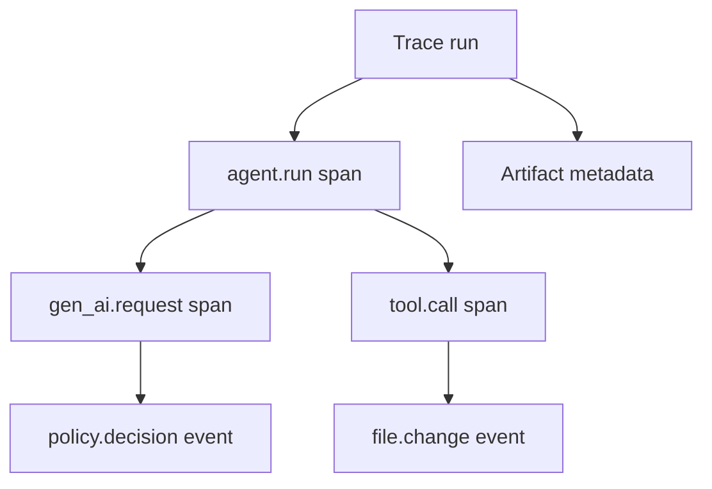

# Session Replay

Replay stores operational traces for Guard requests, MCP decisions, and custom SDK integrations. It is designed to answer:

- where the run failed;
- which tool or policy decision preceded the failure;
- how long each step took;
- how many tokens and estimated cost were recorded;
- how a run differs from a known-good run.

Replay does not intentionally collect hidden chain-of-thought.

## Data model



A run contains summary status, token/cost totals, duration, failure tag, and arbitrary redacted attributes. Spans form a parent/child tree. Events belong to a run and optionally a span. Artifacts store path, MIME type, size, SHA-256, and attributes, not file contents.

## Automatic traces

Every proxied model request creates or updates a Replay trace. MCP decisions create traces containing `tool.call` spans and `policy.decision` events. The UI at `/replay` provides search, project filtering, pinning, a duration timeline, exports, and two-run comparison.

## Python SDK

```python
from app.replay.sdk import ReplayClient

client = ReplayClient("http://127.0.0.1:8787")

with client.trace(project_id="demo", task_id="fix-tests", agent_name="my-agent") as trace:
    with trace.span("command.exec", command="pytest -q") as span:
        span.event("command.output", exit_code=0)

    with trace.span("tool.call", tool_name="read_file") as span:
        span.event("file.change", path="app/example.py")

print(trace.result["run"]["id"])
```

The SDK redacts sensitive attributes before transport. The server redacts again before persistence.

Exceptions mark a span and trace as `error` and add an `exception` event. The original exception is re-raised after ingestion.

## HTTP ingestion

Minimal trace:

```bash
curl -X POST http://127.0.0.1:8787/api/v1/traces \
  -H "Content-Type: application/json" \
  -d '{
    "trace_id": "demo-trace",
    "project_id": "docs",
    "task_id": "example",
    "agent_name": "curl",
    "status": "ok",
    "spans": [{
      "name": "tool.call",
      "start_ns": 1000000,
      "end_ns": 3000000,
      "attributes": {"tool.name": "read_file"},
      "events": [{"name": "tool.result", "attributes": {"status": "ok"}}]
    }]
  }'
```

If IDs or timestamps are omitted, the server generates them. A root `agent.run` span is created automatically.

## Failure tags

When a run has no explicit `failure_tag`, Replay inspects span and event names, statuses, and attributes for deterministic categories:

| Tag | Trigger examples |
| --- | --- |
| `loop` | Loop event or attribute |
| `timeout` | Timeout status or event |
| `rate_limit` | Rate-limit decision |
| `policy_block` | Blocked policy decision |
| `test_failure` | Test-related error or failure |

Tags are intentionally deterministic and explainable. They are not an ML classifier.

## Cost calculation

Provide a model-pricing YAML file and set `ALG_MODEL_PRICING`:

```yaml
models:
  example-model:
    input_micros_per_million: 1000000
    output_micros_per_million: 3000000
```

```bash
export ALG_MODEL_PRICING=/path/to/model-pricing.yml
```

Values are integer micro-units of the billing currency per million tokens. Unknown models receive zero estimated cost. Pricing is local configuration and is not fetched automatically.

## Export and import

```bash
alg replay export TRACE_ID --format json --output trace.json
alg replay export TRACE_ID --format jsonl --output trace.jsonl
alg replay export TRACE_ID --format otel --output trace-otel.json
alg replay import trace.jsonl
```

Formats:

- `json`: native `trace.v1` bundle;
- `jsonl`: one run/span/event/artifact record per line;
- `otel`: OpenTelemetry-shaped `resourceSpans` export with valid hashed trace/span ID lengths.

Import accepts native JSON or JSONL. Imported run, span, event, and artifact IDs are remapped when necessary so repeated imports cannot overwrite an existing trace or break parent links.

## Compare runs

The comparison API and UI report deltas for duration, tokens, cost, span count, and event count. Spans are aligned by name and occurrence, for example `tool.call#2`, with status and duration deltas.

Use comparisons between the same task or task fingerprint; Replay does not enforce semantic task equivalence automatically.
