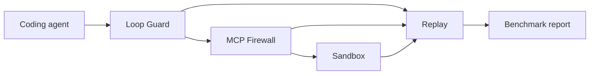

# Agent Loop Guard

Agent Loop Guard is a local, Apache-2.0 toolkit for making coding-agent runs safer, observable, reproducible, and easier to evaluate.

It combines five modules behind one `alg` command:

| Module | Purpose | Maturity |
| --- | --- | --- |
| Loop Guard | Detect repeated requests, tools, errors, sequences, and budget overruns | Alpha |
| MCP Permission Firewall | Filter and approve MCP tools through stdio or Streamable HTTP | Alpha |
| Session Replay | Inspect redacted traces, spans, policy decisions, timing, and cost | Alpha |
| Benchmark Lab | Compare agent configurations with deterministic scoring and confidence intervals | Alpha |
| Sandbox | Run commands in a copied workspace inside a restricted Docker container | Technical preview |



## Why it exists

Coding agents can repeat the same failed action, call a destructive tool, consume an unexpected token budget, or leave too little evidence to explain a failure. Agent Loop Guard provides local controls around those workflows without requiring a paid cloud service.

The default configuration:

- binds to `127.0.0.1`;
- uses a deterministic mock model, so the first demo costs nothing;
- stores metadata in local SQLite;
- does not collect product telemetry;
- keeps full prompt and response logging disabled;
- disables sandbox networking unless explicitly enabled.

!!! warning "Alpha software"
    This project is useful for development and experimentation, but it is not certified security software, enterprise IAM, or a replacement for OS and container hardening. Read the [threat model](security.md) before processing untrusted code.

## Start here

1. [Install the runtime](getting-started/installation.md).
2. Complete the [five-minute quickstart](getting-started/quickstart.md).
3. [Connect Codex, Claude Code, Cline, or OpenCode](getting-started/agent-setup.md).
4. Choose a module guide or open the local dashboard.

```powershell
alg setup
alg doctor
alg guard run
```

The local dashboard is available at `http://127.0.0.1:8787`.

The original project brief is preserved under [source specifications](specs/Agent_Loop_Guard_spec.docx). The implementation and current reference documentation take precedence where the early brief differs from released behavior.

## Privacy summary

Agent Loop Guard records fingerprints, counters, statuses, durations, policy decisions, and redacted attributes. It does not intentionally store chain-of-thought. Secrets matching supported token patterns and sensitive field names are replaced with `[REDACTED]` before serialization. Redaction reduces risk but cannot recognize every possible secret format, so prompts and source code should still be treated carefully.
