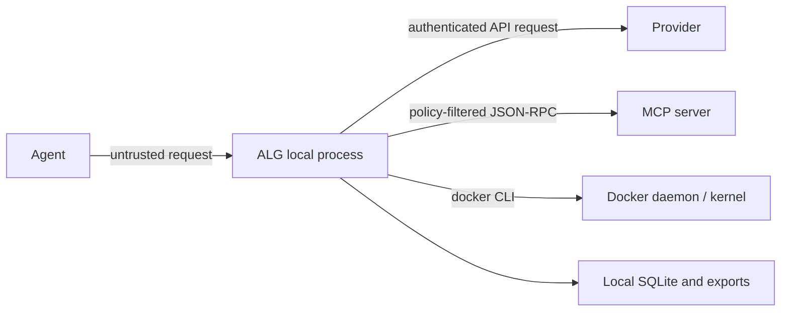

# Threat Model

This document states what Agent Loop Guard tries to protect, the assumptions it makes, and what it does not claim.

## Assets

- source code and project files;
- provider and service credentials;
- local host data outside the project;
- model budget and API quota;
- integrity of policy decisions, traces, and benchmark results.

## Adversaries and failures

The project addresses accidental or prompt-induced loops, unsafe MCP tool calls, path traversal attempts, repeated expensive requests, accidental secret logging, and unreviewed file changes. It also assumes upstream models, MCP servers, repositories, dependencies, and container images may behave incorrectly or maliciously.

## Trust boundaries

The local operating-system account, Python process, configuration files, and SQLite database are trusted. Provider, MCP, Docker, and repository boundaries are external to the core process.

## Security controls

### Guard

- body-size, request-count, and token limits;
- exact, tool, error, and sequence-loop detection;
- Shadow mode for rollout and Enforce mode for blocking;
- session and agent pause controls;
- gateway key for provider-compatible traffic.

### MCP Firewall

- deny-by-default capable YAML policy;
- discovery filtering and argument schema validation;
- path containment and hostname, command, SQL, payload, and rate constraints;
- approval queue with timeout;
- Origin allowlist for browser HTTP clients;
- argument fingerprints and redacted audit records.

### Replay and storage

- metadata-only defaults;
- recursive secret-field redaction;
- no chain-of-thought capture;
- explicit retention cleanup, backup, and export;
- schema migrations rather than silent table replacement.

### Sandbox

- private workspace copy and source hash conflict checks;
- no network by default;
- non-root execution, dropped capabilities, `no-new-privileges`, read-only root;
- CPU, memory, PID, and timeout limits;
- symlink refusal and path containment;
- explicit selective apply.

## Known limitations

- Requests and tools bypassing ALG are invisible to it.
- The local UI and admin APIs are not an internet-facing IAM system.
- Gateway keys are shared secrets, not per-user identities.
- Redaction is heuristic and cannot identify every secret or sensitive code fragment.
- MCP policy matching depends on server-provided names, schemas, and argument shapes.
- Approval queues and rate limits are process-local and reset on restart.
- Docker isolation depends on the daemon, image, host configuration, and kernel.
- Command deny patterns are not a complete shell sandbox.
- SQLite and local export files can be read by the operating-system account.
- The project provides no certification, legal audit guarantee, or protection against unknown vulnerabilities.

## Safe deployment checklist

1. Bind to `127.0.0.1`; do not expose the local UI directly to a network.
2. Replace `alg_demo_key` with a random key and store provider secrets in environment variables.
3. Start MCP policies with `default_action: confirm` or `deny`.
4. Keep full content logging disabled and inspect exports before sharing.
5. Use trusted Docker images, offline network, and strict resource limits.
6. Review Sandbox diffs and apply selected files only.
7. Back up local data before upgrades and restrict file permissions.
8. Keep Python, Docker, MCP servers, and dependencies patched.

## Reporting a vulnerability

Do not publish credentials, exploit details, or private traces in a public issue. Use GitHub private vulnerability reporting for the repository when available. Include the affected version, reproduction steps, impact, and a redacted proof of concept. There is no guaranteed response SLA, but security reports take priority over feature requests.
